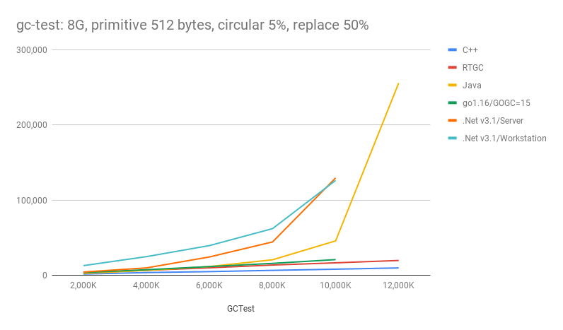
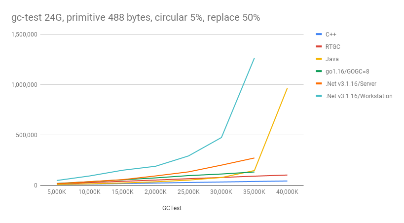

# RTGC 

## What is RTGC
RTGC is a fully automated, real-time garbage collector.<br>
It is based on a reference counting algorithm. However, unlike traditional reference counting systems, RTGC provides fully automated memory management system that automatically detects and reclaims circular reference garbage.

## How it process circluar garbage
- Detect circular reference by tracing reference path
- Create a circuit node that is a virtual object composed of circularly referenced objects
- Maintain the reference count information of objects and circuit nodes
- Reclaim a garbage circuit node whose external reference count becomes zero

## Advantages of RTGC over tracing algoritm
- Maximum memory efficiency<br>
  Garbage object is collected as soon as it becomes unreachable.
- Real time garbage collection even in huge memory usage
  No wasted CPU time marking and scanning non-garbage objects

## Advantages of RTGC over traditinal reference count algoritm
- Fully automated memory management<br>
  No more manual effort to avoid circular garbage (cf. weak_ref and etc. 


## Performance
- [Benchmark test](benchmark)

### Some benchmark results
```
# GCTest mem: 8G, min-payload: 2000k primitive: 512 bytes, circular ref 5%, replace 50%
> ./gc-test all 8 2000 512 5 50
```
| Payroad          |  2,000K |  4,000K |  6,000K |  8,000K | 10,000K | 12,000K |	
|:----------------:|--------:|--------:|--------:|--------:|--------:|--------:|
| C++	           |   1,735 |   3,702 |   4,947 |   6,626 |   8,173 |   9,876 |	
| RTGC             |   3,474 |   6,667 |  10,023 |  13,712 |  16,639 |  19,775 |	
| Java             |   2,616 |   6,591 |  11,702 |  20,689 |  45,838 | 255,814 |	
| .Net Server      |   4,419 |   9,894 |  24,470 |  44,433 | 129,568 |    #OOM |
| .Net Workstation |  12,913 |  24,885 |  39,591 |  62,130 | 126,266 |    #OOM |


<br>
```
# GCTest mem: 24G, min-payload: 5000k primitive: 488 bytes, circular ref 5%, replace 50%
> ./gc-test all 24 5000 488 5 50
```
| Payroad          |   5,000K |  10,000K |  15,000K |  20,000K |  25,000K |  30,000K |  35,000K |  40,000K |
|:----------------:|---------:|---------:|---------:|---------:|---------:|---------:|---------:|---------:|
| C++              |    5,587 |   11,376 |   16,515 |   21,688 |   26,735 |   31,927 |   37,096 |   42,060 |
| RTGC             |   13,573 |   25,934 |   38,543 |   51,126 |   64,598 |   76,928 |   89,851 |  101,054 | 
| Java             |    7,660 |   13,844 |   22,077 |   33,835 |   50,666 |   76,418 |  145,476 |  964,376 |
| .Net Server      |   15,256 |   35,079 |   55,125 |   91,927 |  132,418 |  199,271 |  270,200 |     #OOM |
| .Net Workstation |   46,698 |   91,915 |  148,716 |  188,042 |  290,602 |  473,526 |1,262,806 |     #OOM |


