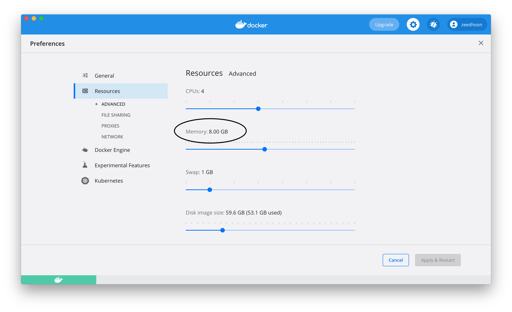

# GC Benchmark

## Requirements to execute GC benchmark
- [docker](https://www.docker.com/products/docker-desktop)<br>
  at least 8G docker memory
- bash shell<br>
  for windows: WSL, Cygwin or [Git Bash](https://git-scm.com/downloads)
<br>
<br>

## Additonal setup for Mac & Windows 
Set docker memory >= 8G

<br>
<br>

## Executing benchmark script
./gc-test all MEM_SIZE PAYLOAD PRIMITIVE_BYTES CIRCULAR_REF% REPLACE%
- MEM_SIZE : Heap memory size / Giga. (It must be less or equal to docker memory.)
- PAYLOAD : Minimum number of stress test nodes / 1024
- PRIMITIVE_BYTES : Primitive data size per node
- CIRCULAR_REF% : Percentage of cirularly referenced nodes
- REPLACE% : Percentage of replaceable nodes
```
# ex) mem: 8G, paylod: 2000K, primitive: 512 bytes, circular-ref: 5%, replacement: 50%
> ./gc-test all 8 2000 512 5 50

# ex) mem: 8G, paylod: 3000K, primitive: 160 bytes, circular-ref: 1%, replacement: 75%
> ./gc-test all 8 3000 160 1 75

# ex) mem: 24G, paylod: 5000K, primitive: 512 bytes, circular-ref: 2%, replacement: 100%
> sudo ./gc-test all 24 5000 512 2 100
```

## Execute test for a specific platform
./gc-test PLATFORM MEM_SIZE PAYLOAD PRIMITIVE_BYTES CIRCULAR_REF% REPLACE%<br>
Testable platforms: cpp rtgc java dotnet go 
```
# ex) 
> ./gc-test cpp  8 2000 512 5 50
> ./gc-test rtgc 8 2000 512 5 50
> ./gc-test dotnet 8 2000 512 5 50 true  # enable Server mode GC.
> ./gc-test dotnet 8 2000 512 5 50 false # disable Server mode GC.
> ./gc-test java 8 2000 512 5 50
> ./gc-test go   8 2000 512 5 50
```

## How to adjust test conditions
- Better performance conditions for RTGC<br>
  1. Larger primitive bytes. It more often requests GC.
  2. Smaller circular reference rate. 
  3. Larger replace rate. It reduces generational GC effciency.

## Test conditions and effects
|                  |  RTGC    |  Tracing Algorithm |
|:----------------:|:--------:|:--------:|
| Memory Size      | Nothing | GC execution frequency | 
| Primitive bytes  | Nothing | GC execution frequency |
| Circular ref%    | Circuit data manipulation | Nothing |
| Replace%         | Nothing | generational GC algorithm effciency |

